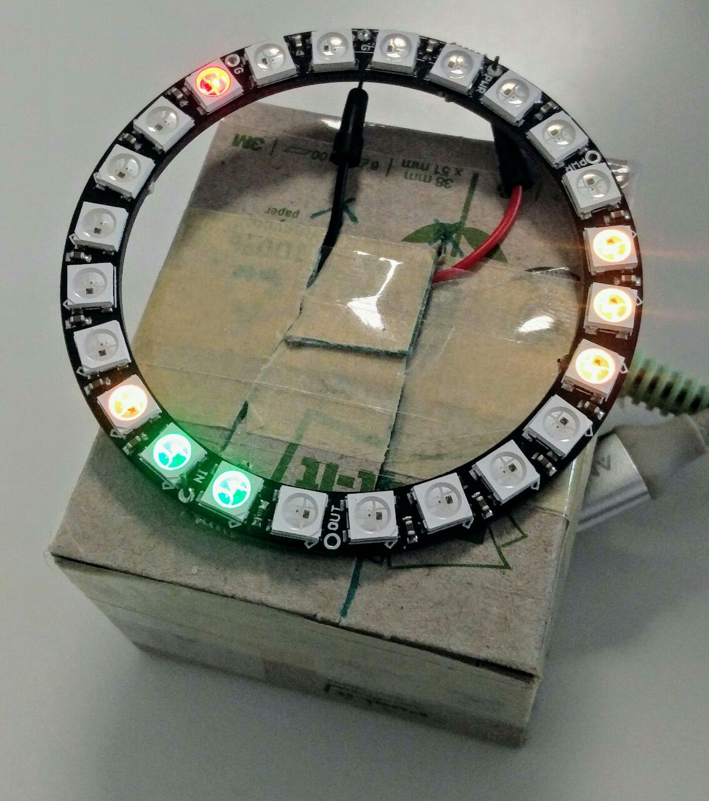
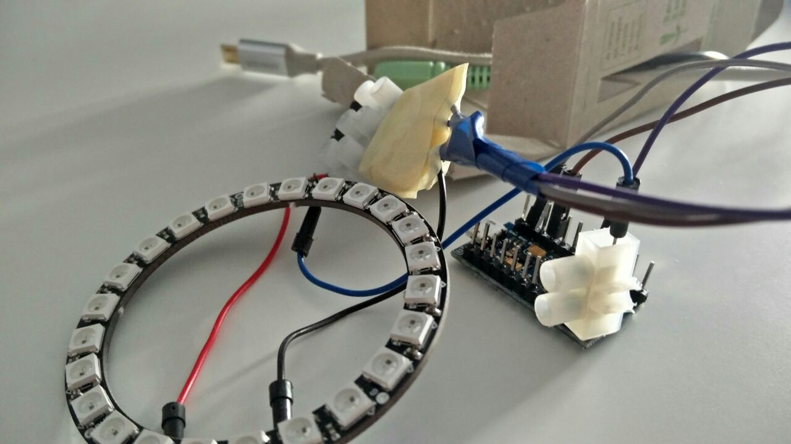
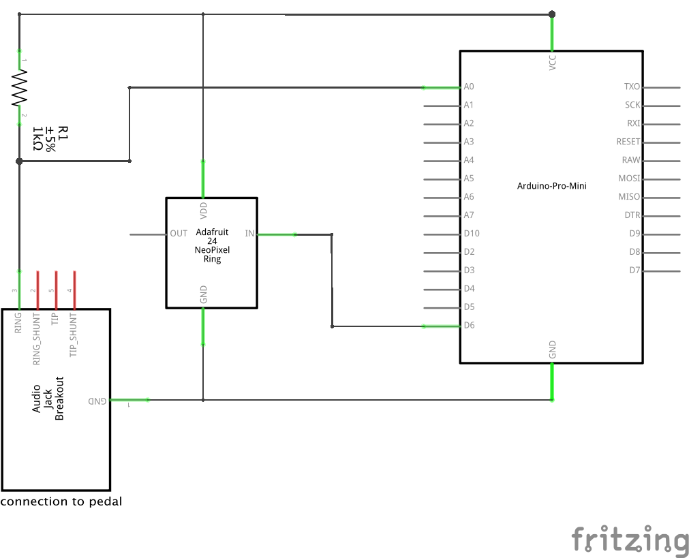
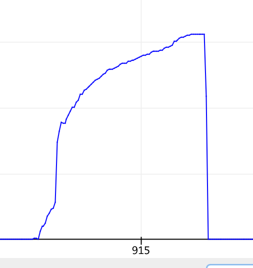
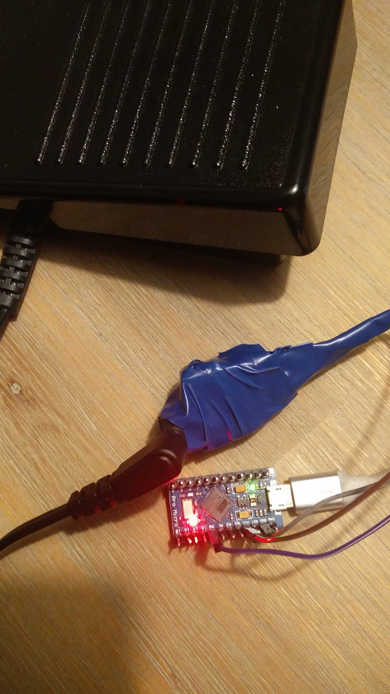
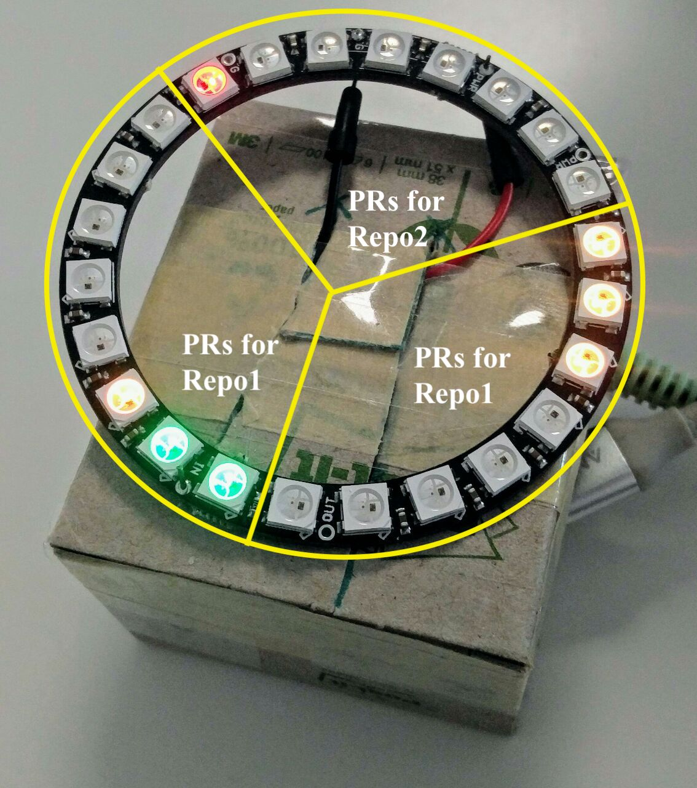

# Programming Pedal

This is about combining an arduino with and LED-Ring and my wifes sewing machines foot pedal into a programming tool. It acts as a keyboard and presses keystrokes depending on how much you press the pedal. It also shows you the state of currently open PRs in your favourite github repositories with different colors on the LED ring.



The hardware parts I used are:

* [Arduino Pro Micro (ATmega32U5 5V)](https://www.sparkfun.com/products/12640) - I found it for about $5
* The [NeoPixel Ring - 24 x 5050 RGB LED Ring](https://www.adafruit.com/product/1586) - found it for about $16
* Optional: My wifes sewing machine foot pedal - got it for free, but found similar paddles (the ones that connect via a 3.5mm audio jack) for around $13
* An 1 kOhm resistor (only necessary if you use the paddle)

These parts are connected in the following way:

```
    3.5mm audio jack
   ········> >··················                   
   ·                           ·                   +-----------------+
+-----+                        ·         serial    |                 |
|     |                        ·         over usb  |                 |
|     |        * *             ·       ············|                 |
|     |      *     *          +-+      ·           |                 |
|     |     *       * ········| |·······           |                 |
|     |      *     *          +-+                  +--------+--------+
|     |        * *                                          |
+-----+                                                  +--+--+
 Pedal      LED-Ring        Arduino                      Computer
```

This thing is flexible enough to just use the LED-Ring or just the paddle if you don't want both.

Read more about the hardware in the [arduino-chapter](#arduino) and the software that sits on the computer in the [client-chapter](#client).

## Arduino



The pedal got connected to an analog input port (`A0`) to the arduino. The LED-Ring connects to a digital output port (`D9` in my case, but both ports are configurable and the ports you choose really doen't matter :)).  The arduino connects to the computer as a HUD (simulating a keyboard) and, in parrallel, opens a serial port through which the computer can send commands to light up LEDs.



Please find the arduino code in `pedal/pedal.ino`, copy it into the arduino GUI and adapt it to your likings.
To compile it don't forget to import the [light_ws2812 library](https://github.com/cpldcpu/light_ws2812).

### The paddle

Reading values from the paddle works via a simple [voltage divider circuit](https://en.wikipedia.org/wiki/Voltage_divider).
The paddle (depending on how deep you press) acts as a resistor with a resistance from 0 Ohm up to 20 kOhm.
I figured out that usign an 1 kOhm resistor as the second resistor gives a good range of values (the `A0` input reads the voltage as int values depending on the voltage on the port -- the 1 kOhm resistor gives values from 0 to 1000 from the maximum possible range of up to 1024 values).
Resistors with smaller resistance produced too flaky values for me whereas higher resistances resulted in a lower range of readable values on the input port.

I measured how the input values change when I constantly press the paddle.
It turns out that pressing the paddle does not change the values in a linear fashion.



My paddle connects via an normal 3.5mm audio jack which is super convenient when you need to extend the cable for some reasons or want to make the paddle optional and pluggable.



I assume all paddle which connect with an audio jack work similarly, so you should have a wide range of paddles to choose from.

## Client

On the computer-side there is currently a ruby-script controlling the LEDs.
The script just sends 4-byte commands via the serial port -- this can be done in any language but prototyping this in ruby was fastest for me.
Clients in other languages might follow (or contribute your own if you like).

TBD: write about the following:

* bundle install
* `.env` file
  * github token
  * serial port
* configure repositories




